# Linux

Big data almost never lives on your laptop. It sits on remote servers, cloud machines, and computing clusters, and nearly all of them run Linux, usually with no GUI; all you get is a terminal with a prompt. To work with data at scale, you must begin to be comfortable with the Linux command line. You connect to remote machines with ssh, move file, keep long jobs running after you disconnect, and check memory, CPU, disk usage, running processes to see why a job is slow or crashing. Linux tools are also built for data too large to open, so you can inspect, filter, count, and compress a 100 GB file without ever loading it into memory. Chaining them with pipes is a form of streaming computation.

If you are using Linux already, you obviously have nothing to do. If you have the ability to install a machine from scratch, I will prefer Ubuntu; it is one of the most widely used systems on cloud machines and servers, so what you learn on your laptop is what you will find in practice. Please install the current long-term support (LTS) release, Ubuntu 26.04.

## How to "Install Linux" on Windows

Carefully follow the setup instructions in the file "install-wsl-ubuntu.qmd".

## For MAC users

Mac users do not need to switch to Linux as macOS is itself a certified Unix, built on BSD, a close relative of Linux, so the shell, pipes, file system layout, permissions, ssh, and *nearly* every command work the same way. The differences are small, such as an occasional flag that behaves differently and installing the GNU versions of these tools with Homebrew removes most of them:

```bash
brew install coreutils gnu-sed grep
```

We'll also need a few more programs to equalize with ubuntu:

```bash
brew install htop
```

If you don't have brew installed yet, you first install brew by following the instructions at <https://brew.sh> then return and do the above. Verify using `git --version` that git is successfully installed.

Everything you practice in the Mac terminal carries over directly to the Linux servers you will use. Finally, the shell is what connects the main data science tools of this class (R, Python, SQL, git, and Quarto) into one reproducible pipeline. Data scientists who are fluent at the command line can work wherever their data lives, not only where a familiar interface happens to be installed.

# git

Now that linux is installed, we can turn to source control. In the software engineering and data science worlds, git is the standard source control program thus it's worth it to learn now. Thus, you'll be submitting your assignments with git and github. Some of you already have experience with git. Read over this section to make sure every piece is set up correctly.

The first step is to make sure you have git on your computer. It comes preinstalled on most flavors on Linux including the Ubuntu you installed via WSL on Windows. For the MAC, it is usually preinstalled. Try by running

```bash
git --version
```

If you see "git version \<number\>", then it's installed. If you are on MAC and this command is not recognized, you can install git by opening the terminal and running

```bash
brew install git
```

You should set up your name and email address in git in anticipationg of using github now:

```bash
git config --global user.name "Your Name"
git config --global user.email "you@mail.huji.ac.il"
```

In the terminal, navigate to the folder you want to store your class materials using the "cd" command. If you are okay keeping your class materials in your default home folder, then do nothing. I suggest you create a new subfolder to keep your projects, something like:

```bash
mkdir workspace
cd workspace
```

We now setup your own security keys. This can be done by typing in the following command

```bash
ssh-keygen -t ed25519 -C "type your email address here"
```

I use no password so I just press enter three times now. This is more convenient, but less secure as if someone gains access to your laptop, they can impersonate your github account and whatever else uses these keys. If the key creation is successful, you should see something like the following message:

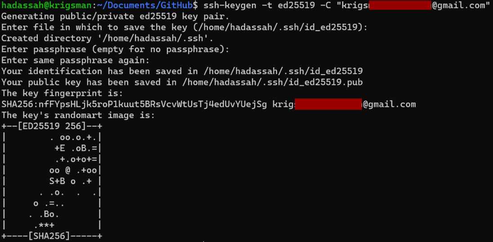{width="6.5in"}

# github.com and your git repo

If you don't already have a github.com account, go to github.com and create one. Use a username/handle that's appropriate! Employers will see it! Then login to github.com and keep that browser open for the rest of the setup.

Now, send me an direct message on discord with (1) your full name (2) your HUJI student ID number and (3) your github homepage link (e.g. mine is <https://github.com/kapelner>). I need all three because I don't know what your handle name : full name mapping and thus I / the TA won't be able to grade your assignments!

We then add your personal security key to github. You can do this by clicking on your account icon in the top right corner of your account homepage and clicking settings:

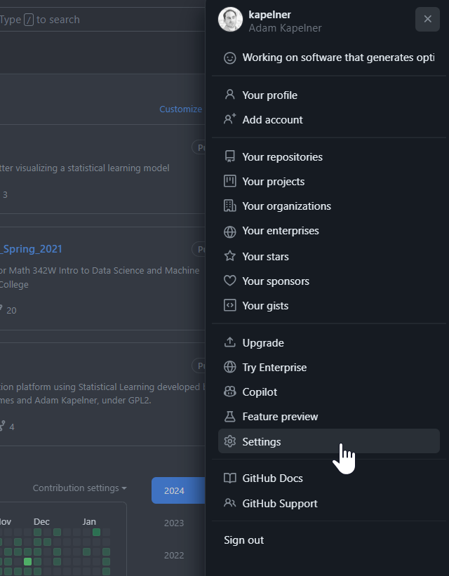{width="5.68in"}

Afterwards you'll click on the "SSH and GPG keys" on the left menu:

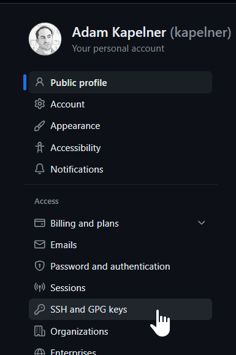{width="4.01in"}

Now click the "New SSH key" in the top right

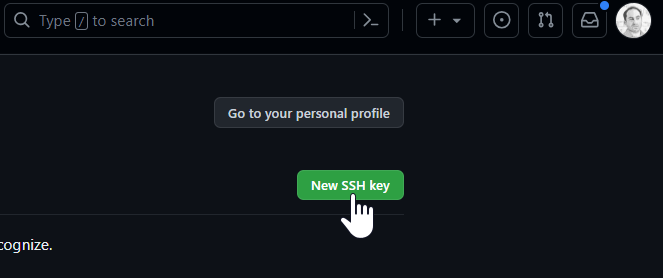{width="5.07in"}

The title is up to you. The key belongs to a computer, so if you have multiple computers, you may want to name this key with something that identifies the computer. I use "my_lab_laptop".

Now you need to open your public key that you generated. I use the following

```bash
cat ~/.ssh/id_ed25519.pub
```

You should see something like this

```text
ssh-ed25519 AAAC3NzaC1lZDI1NTE5AAAAIK0wmN/Cr3JXqmLW7u+g9pTh+wyqDHpSQEIQczXkVx9q   
  kapelner@gmail.com
```

There is no risk sharing your public key. It can be "public"! It's how people give you access to services.

Now you need to copy that text ***exactly*** and paste it into the "key" field so the final screen should look like this:

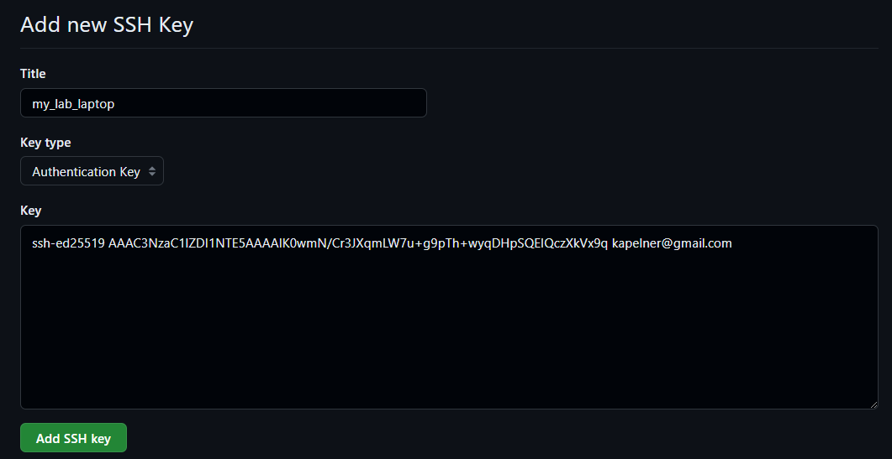{width="7.26in"}

Now press "Add SSH key".

Github is now set up to communicate with the laptop you're using to follow this tutorial. If you have multiple computers you want to use for this class, you need to repeat the two steps for all those computers (a) key generation, (b) add key to github.

Go back to the terminal window and exit the vim editor by typing ":q" and pressing enter. You should now be back to the plain terminal screen.

Okay now you are ready to create your own repository, the repository that will store all your homeworks and labs. Go to github.com and click the green new button:

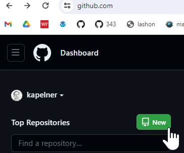{width="2.34in"}

Under "repository name" type "HUJI_52002_Fall_2026". Then click the "private" button (we will do this for now to prevent cheating). You are free to make it public at the end of the semester if you are proud of your assignments.

Then check the box "Add a README file". That checkbox is required as otherwise you won't be able to clone. Your screen should look like:

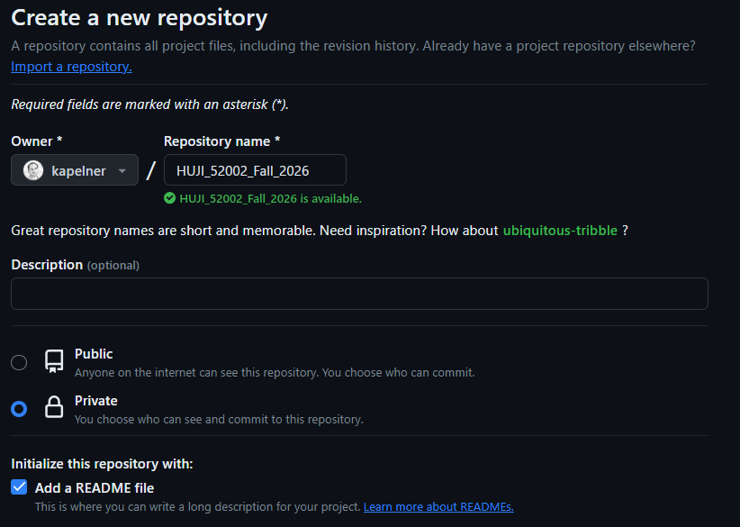{width="6.53in"}

On the bottom, click the green "Create Repository" button. You should now be taken to the repository homepage. As before, we want to clone it. So click the green "Code" button and then the SSH option and click the copy button until you see the green check mark:

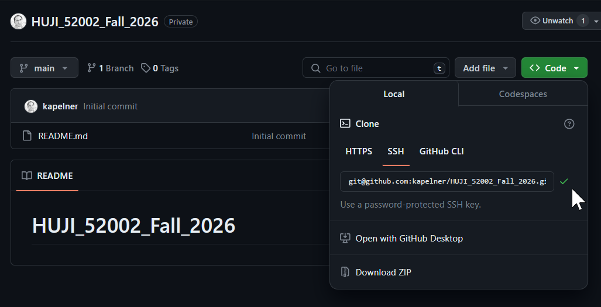{width="5.66in"}

Now let's clone it which will put it on your computer and allow you to add and edit files. Go back to your terminal. Type the following and paste that copied text where it says so:

```bash
git clone [paste]
```

For \[paste\] you'll press ctrl + v (or command + v or shift + insert) to paste your ssh link that you just copied from your repo page. My link is "git@github.com:kapelner/HUJI_52002_Fall_2026.git" but yours will be different as your username will replace my username, "kapelner". Press enter to run. If it complains "are you sure..." just type "yes". You now will have your repository folder on your computer. Let's go inside that folder

```bash
cd HUJI_52002_Fall_2026
```

You can also make a subfolder for the homework assignments:

```bash
mkdir labs
mkdir theory
```

where labs will be computer-based assignments and theory will be paper- and pencil-based assignments.

The last step is to add me and the TA as a collaborator on your private repo. This allows us to access your files and grade your assignments. If you don't do this, you will obviously not get credit for any of your homeworks. On the repository page, click "Settings" and then on the left menu, click "Collaborators" and you'll see:

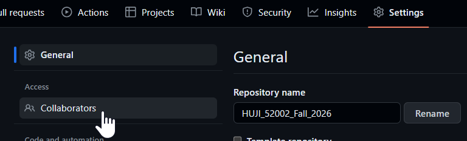{width="6.01in"}

Now it will ask for your password again. Then click the green "Add People" button and you'll see:

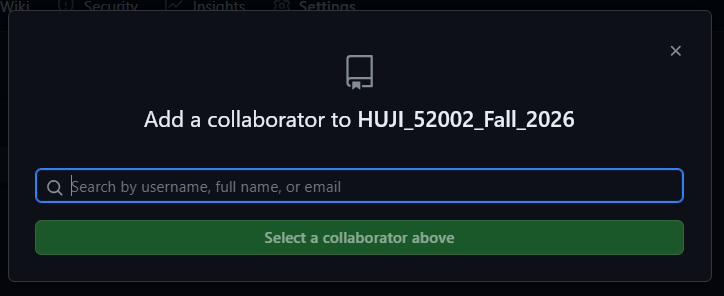{width="5.07in"}

You'll type in "Eynat1" (that's your TA's handle) for and click the dropdown account when it comes up.

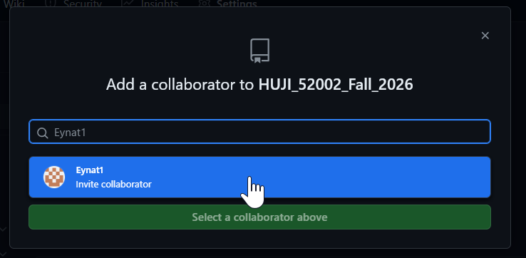{width="5.08in"}

And click "Add Eynat1" to this repository.

Now repeat this process again to add a second collaborator, me. Type in "kapelner" then select my account and then click "Add kapelner to this repository".

If done correctly, you should see both of us as "pending Invite".

Congrats you're now al set up! There are many great resources about git you can find online if you want to learn more.

# How to Upload your Homework Assignments

Since you are setting this up at the beginning of the semester, I will use lab 1 as the canonical example. First, go to lab 1 on the course homepage via navigating your browser to <https://github.com/kapelner/HUJI_52002_Fall_2026/blob/main/labs/lab01.qmd> and then download the lab using the "download raw file" icon. Now move this downloaded file "lab01.Rmd" into your HUJI_52002_Fall_2026/labs folder via something like

```bash
mv ~/Downloads/lab01.qmd ~/workspace/HUJI_52002_Fall_2026/labs/lab01.qmd
```

We will now add this file to your git source control repository by running

```bash
git add .
```

from the terminal. The "add" command adds new files to the source control. You only need to run it when you create new files, not when you edit old files. You can make sure lab01.qmd is added by running

```bash
git status
```

You should see it listed in green. The "status" commands tells you if anything has changed. Now we will commit this file. Always write comments that make sense.

```bash
git commit -am "added lab01 assignment"
```

Now we're ready to push these commits to github via

```bash
git push
```

If this worked successfully, upon refreshing your github repo page you'll see the new directory.

In the future, you'll repeat this

```bash
git add .
git commit -am "lab x or some other comment"
git push
```

sequence for each new assignment (lab or theory). For the theory homeworks, you'll add the PDF of your scanned homework to the homeworks directory and name it "hw0x.pdf".

Make sure they're in the appropriate places otherwise the TA gives an automatic zero.

# Scratchpad for class demos

Let's add a directory for in-class demos and otherwise scratch pad work:

```bash
mkdir -p ~/workspace/HUJI_52002_Fall_2026/scratch
```

Since you have no need to permanently keep the work within, we don't want to commit this (it's not your assignment), so we'll ignore it via the `.gitignore` file:

```bash
echo "scratch/" >> ~/workspace/HUJI_52002_Fall_2026/.gitignore
```

This adds the line `scratch/` to the end of `.gitignore` (and also creating the `.gitignore` file if it doesn't exist yet). The `.gitignore` file itself does get committed, which will happen the next time you run `git add .`.


